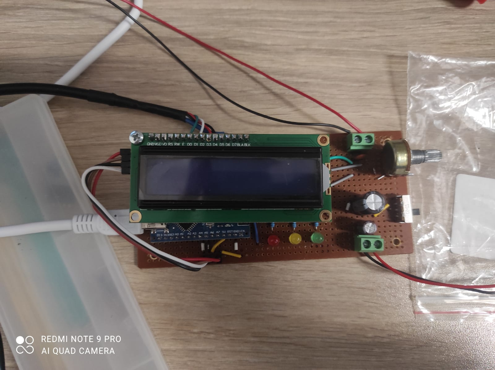

# Single Axis Actuated Robot Joint (PID Control)


## 📖 Overview
This project involves the design and development of the control system for a single-axis revolute joint mechanism. The system is designed to achieve precise angular positioning under payload using a closed-loop **PID control algorithm**.

Developed as a term project for the **MEE 311 - Mechanism Design I** course.

## ⚙️ Features
* **Closed-Loop Control:** Implemented PID algorithm to minimize position error (Target: < 2° error).
* **State Machine Architecture:** Defines logical states (Approaching, Target Reached, Coarse Adjustment) for robust operation.
* **User Interface:** Real-time status monitoring via LCD (Target vs. Current Angle) and setpoint adjustment via potentiometer.
* **Safety Mechanisms:** Includes "Electronic Hard Stop" and active braking logic to prevent mechanical overshoot.
* **Sensor Fusion:** Uses interrupt-based reading from a high-resolution optical encoder.

## 🔧 Hardware Stack
* **Microcontroller:** Arduino Nano (ATmega328P)
* **Actuator:** Geared DC Motor (12V)
* **Driver:** TB6612FNG Dual Motor Driver
* **Feedback:** Incremental Optical Rotary Encoder (Phase A/B Interrupts)
* **Display:** 16x2 I2C LCD Display
* **Power:** 7.4V Li-ion Battery configuration

## 🔌 Circuit
The electronic control unit was designed and soldered on a custom prototyping board.



## 💻 Software Architecture
The firmware is written in C++ using the Arduino framework. It utilizes a Timer Interrupt for encoder ticks and a main loop for PID calculation and LCD updates.

### Control Flow


### Key Code Snippet (PID Logic)
```cpp
// Basic representation of the PID implementation
float error = targetAngle - currentAngle;
integral += error * (current_time - last_time);
float derivative = (error - previousError) / (current_time - last_time);

float controlSignal = Kp * error + Ki * integral + Kd * derivative;
```
## 🚀 Results

Precision: The mechanism achieved the desired position with less than 2 degrees of deviation.

Response: Optimized Kp, Ki, Kd values provided a stable response without excessive oscillation.

## 👥 My Teammates

- Efe Tuna Çalışkan
- Nuri Kaan Gençtürk
- Deniz Tuna Yasemin
- Beyza Demir
